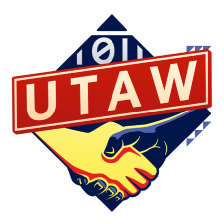

# Which union should I join?

## Unite the Union

Unite is the largest union in the UK & Ireland, and the one with the most members at Google.

**Main focus:** Unite is a traditional union, made of workers from diverse backgrounds, and focused on more general topics in organizing (salaries, redundancies, harassment, disciplinary…). **They are excellent to help you out if you have issues** because the union officers are highly qualified and already helped out a lot of Googlers in grievance or disciplinary hearings. But it is harder to propose / organize something new at Unite because it is huge and hierarchical.

[Join here](https://join.unitetheunion.org/)

[Tech branch website](https://www.unitedigitaltech.org/)

## United Tech & Allied Workers Union (UTAW)

UTAW is a very independent branch of the Communication Workers Union (CWU), grew out of the London Tech Workers Coalition (TWC).

**Main focus:** UTAW is a young union, extremely well organized and managed, with separate working groups for specific issues or questions. The newly appointed officer is open to all suggestions of projects and will gladly support you. This union is much simpler to navigate, but they may also lack a bit of experience with grievance hearings and such (so far! But they’re growing fast)

[Join here](https://utaw.tech/)